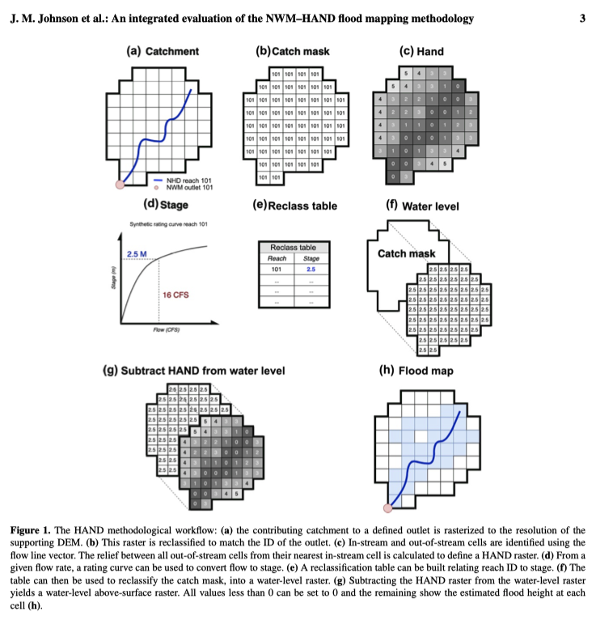

# Where's the flood?

This repo offers a simple interface implementing the 'Nervous Norman' prototype for the UFOKN project. The test cases integrates [NOAA National Water Model](https://water.noaa.gov/about/nwm), [Height above Nearest Drainage](https://web.corral.tacc.utexas.edu/nfiedata/) Data provided by the University of Texas, road infrastructure from the US Census, and Building footprint information from Open Street Map.

The spatial scope of this product is the city of Houston Texas and the temporal scope is the period of Hurricane Harvey (09/10/2017 - 08/18/2017).The archived NWM output for this event has been archived by CUAHSI [here](http://thredds.hydroshare.org/thredds/catalog/nwm/harvey/catalog.html) and is representative of the operational data that is available in real-time for any location in the continental United States. 

It aims to integrate work related to continental flood mapping with impact based assessment through a spatially informed knowledge graph. This graph will (A) store the explicit relationships between infrastructure and their hydrographic membership; (B) along with

The organizing unit of this workflow is the NHD catchment, which related to a single NHD flow line and a single outlet point. These 

Synthetic Rating Curves are developed using a composite Manning's N value as defined in Eyolade, Johnson (2020). Further the rating curve information will be cataloged not as hydraulic property tables but as power law relationships in the form:

Y = aQ^b

Use Case: https://docs.google.com/document/d/1G5qX-qnK2PqoUEDnKzLsOBsMMjIZlDlWuG1mZygO5YY/edit
